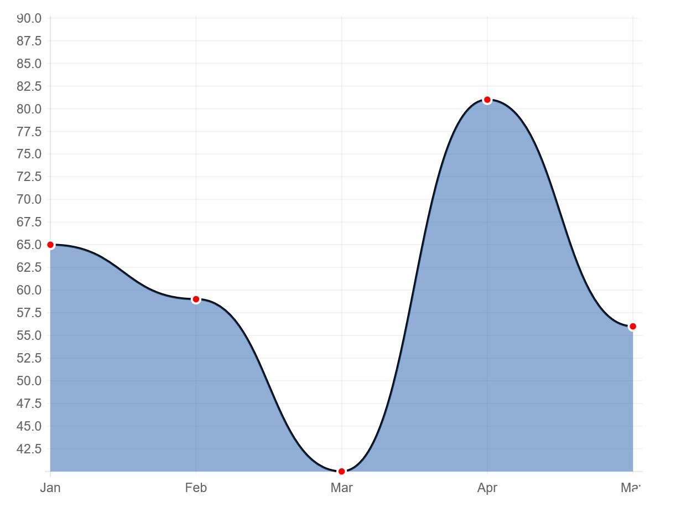
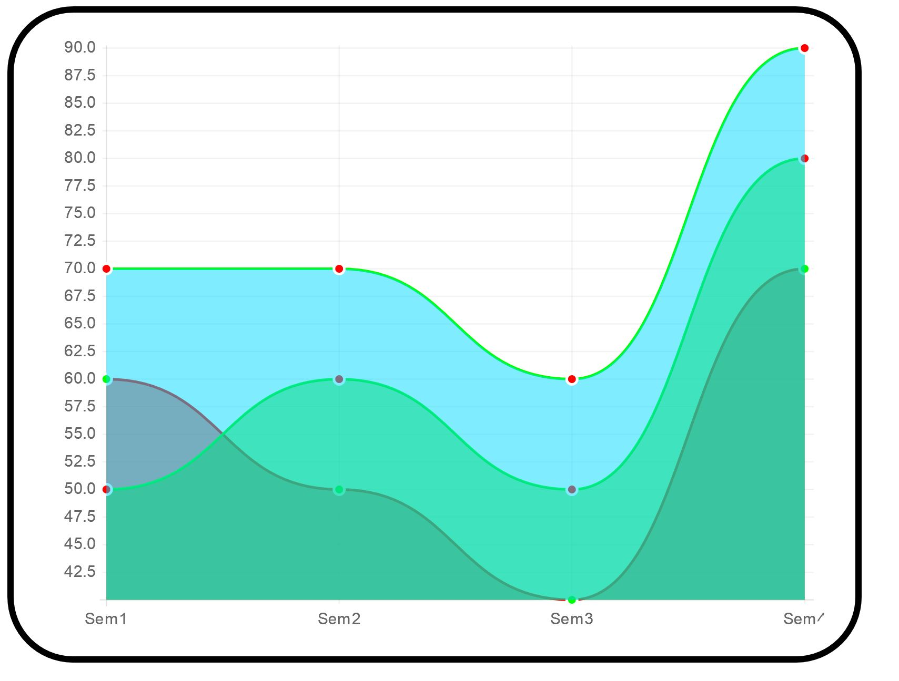
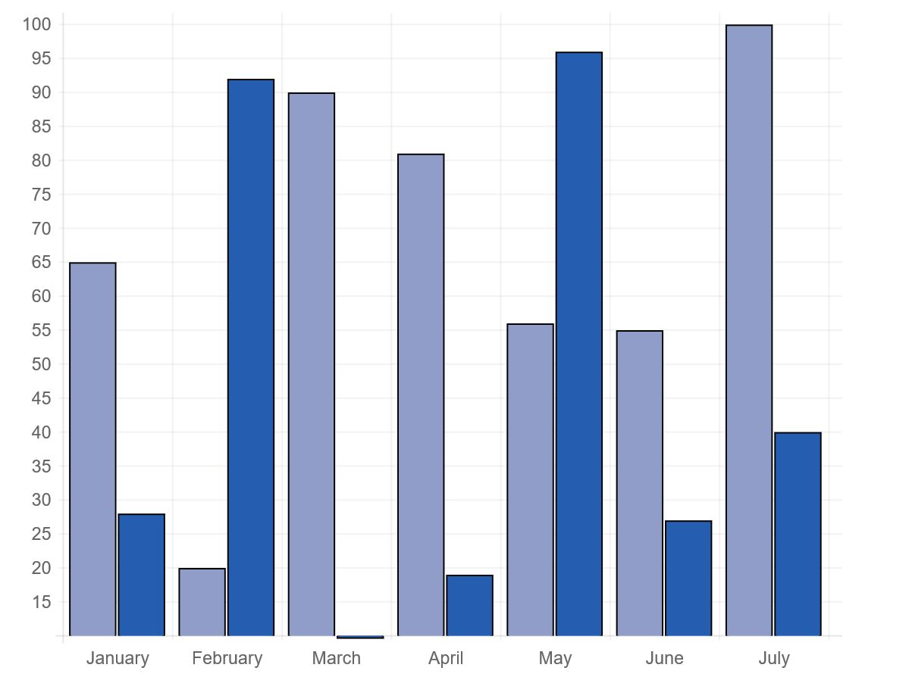
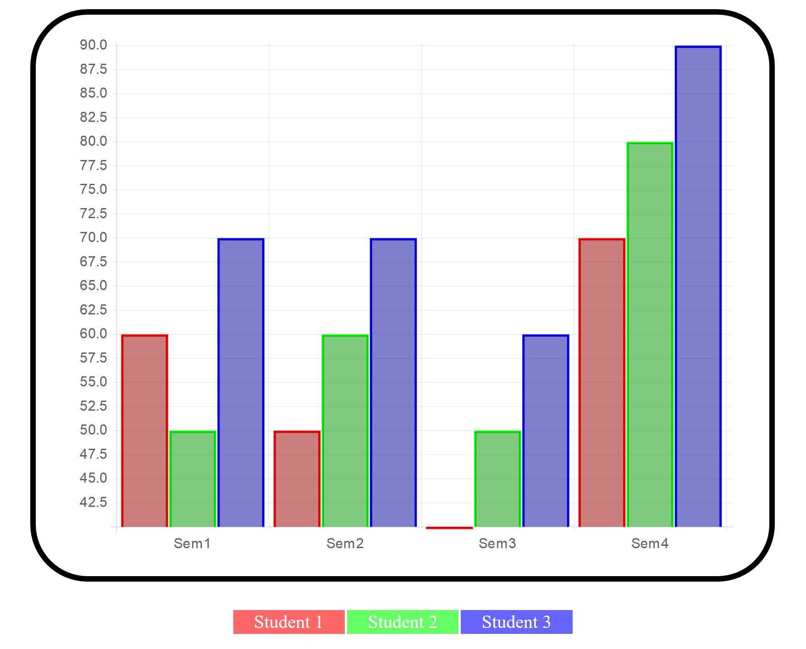

# JSON_drawChart

@ HTML, AJAX, JSON(XML)

Draw charts with JSON data on the canvas of HTML. 

  

HTML Canvas Reference 
-----
 
The HTML5 <canvas> tag is used to draw graphics.  

However, the <canvas> element has no drawing abilities, it is only a container for graphics
	
we must use a script to actually draw the graphics.

Method of Canvas
----

- getContext() : returns an object that provides methods and properties for drawing on the canvas 
  
  getContext("2d") object, which can be used to draw text, lines, boxes, circles, and more  on the canvas.

		The order to draw on the canvas
		
                1. contain in script
		
		cvs = document.getElementById("canvas");
		ctx = cvs.getContext('2d');
		myChart = new Chart(ctx).Line(chartData);
		
		2. contain in body
		
		<canvas id="canvas" height="450" width="600"></canvas>
		
			
Canvas Property
-----
 

fillStyle	- Sets or returns the color, gradient, or pattern used to fill the drawing

strokeStyle	- Sets or returns the color, gradient, or pattern used for strokes

shadowColor	- Sets or returns the color to use for shadows

shadowBlur	- Sets or returns the blur level for shadows

shadowOffsetX	- Sets or returns the horizontal distance of the shadow from the shape

shadowOffsetY	- Sets or returns the vertical distance of the shadow from the shape

    myChart = new Chart(ctx).Line(chartData);
    
    var chartData = 
	{
		labels : ["Jan", "Feb", "Mar", "Apr", "May"],
		datasets: [
			  {
			  // color is optional, if not, default is grey
			  // R,G,B color, gradient(0 ~ 1) 
			    fillColor : "rgba(37, 94, 177, 0.5)",
			    strokeColor : "rgba(0, 0, 0, 1)",
			    pointColor : "rgba(255, 0, 0, 1)",
			    pointStrokeColor : "#fff",

			 // mandatory data information
			    data : [65, 59, 40, 81, 56]
			}
			]
	}

Create JSON Data in xml format (chart.xml)
----

	<data>
		<month name="January">
			<number>65</number>
			<number>28</number>
		</month>
		<month name="February">
			<number>20</number>
			<number>92</number>
		</month>
		<month name="March">
			<number>90</number>
			<number>10</number>
		</month>
		<month name="April">
			<number>81</number>
			<number>19</number>
		</month>
	</data>

Load XML data 
------

		$(document).ready(function() {
			$.ajax({
				type: "GET",
				url: "chart.xml",
				dataType: "xml",
				success:loadChartData
			});
		});
		

Create method to call
-------

		function loadChartData(xml)
		{
			// load up values from XML
			xx = 0;
			$(xml).find("month").each(function() {
				labels[xx] = $(this).attr("name");
				
				yy=0;
				$(this).find('number').each(function() {
					if (yy==0) {
						data1[xx] = parseInt($(this).text());
						yy++;}
					else {
						data2[xx] = parseInt($(this).text());}
				});
				xx++;
			});
		}

Graph Outout
----

